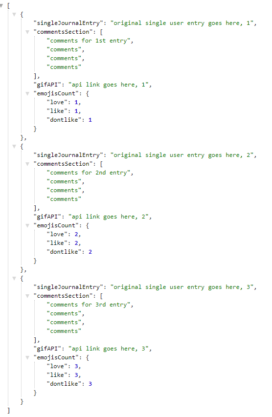
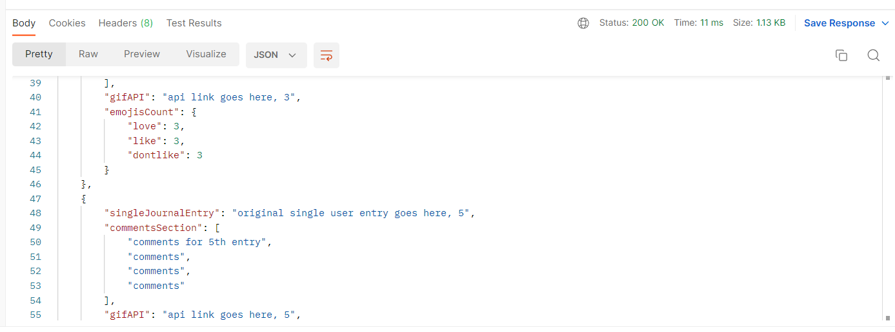
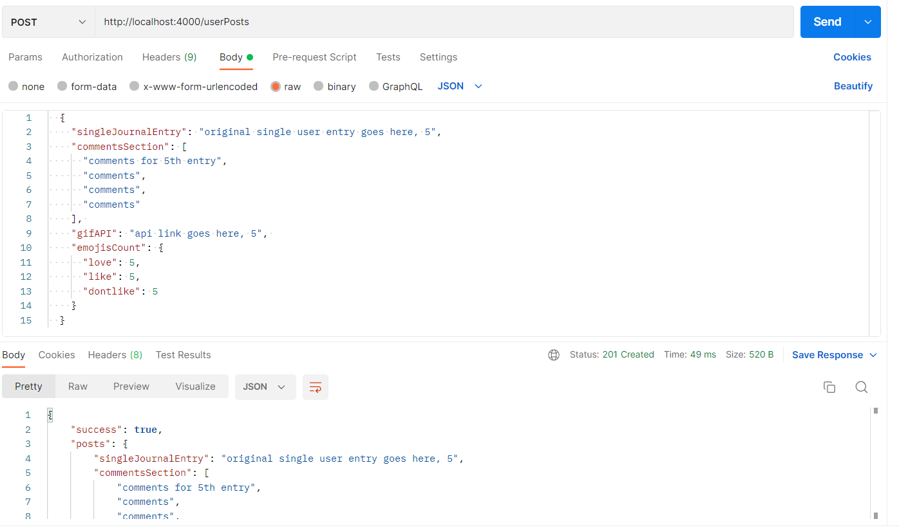

# LAP 1 Portfolio Week Project Backend

## Project description

This is the server side portion repository of a community journaling website. The client side portion repository of this website can be found [here](https://github.com/nasim1903/Journal-frontend) **_OR_** [here](https://github.com/nasim1903/Journal-Front-new). This client side repository is responsible to allowing users to see previous posts and/or comments made by other users on the journaling website. It interacts with the client side so the information can be seen by the users on the browser upon request. The server will also allow the user to see the post and/or comments made by themselves if they were, for example, to leave the site and come back. This project is made up of data.js file to store the user's inputs. It has an index.js file were the app listens on port 3000. It also has an app.js file which contains the `get()` and `post()` methods responsible to sending responses to requests. The package.json file located in this project contains all the modules and software that were installed. This project also contains tests that were used to ensure the project ran without errors.

## Installation

- Use **_git clone_** to clone the repository.
- Use **_git init_** to get the most update version of the repository.
- Download the repository at the top of this GitHub page.

## Usage

1. Open project in a code editor.
2. Open the terminal.
3. In the terminal, navigate to the **_server_** folder.
4. Enter **_node index.js_** in the terminal.
5. The project will run at **_localhost:3000_**.

## Technologies

- The following technologies were used:

  - [Postman](https://www.postman.com/)
  - [Heroku](https://www.heroku.com/)
  - [JavaScript](https://developer.mozilla.org/en-US/docs/Web/JavaScript)
  - [nodemon](https://www.npmjs.com/package/nodemon)
  - [express](https://www.npmjs.com/package/express)
  - [jest](https://jestjs.io/docs/getting-started)
  - [coverage](https://www.npmjs.com/package/coverage)
  - [cors](https://www.npmjs.com/package/cors)
  - [node](https://nodejs.org/en/)
  - [supertest](https://www.npmjs.com/package/supertest)

- `npm install` was used to install the following technologies.
- `npm install --save-dev` to install dependencies.
- `npm start` to launch server.
- `npm run test` to launch test suite.
- `npm run coverage` to test for coverage.

## Process

- app.js

  1. Require **_express_** and **_cors_**.
  2. Use **_express()_** stored in a variable.

  ```
  const express = require("express");
  const cors = require("cors");
  const app = express();
  ```

  3. Use **_cors_** and **_express.json()_** with **_app.use_**.

  ```
  app.use(cors());
  app.use(express.json());
  ```

  4. Make get requests using the desired path for the user data to be read.

  ```
    app.get("/userPosts/:id/gifAPI", (req, res) => {
    const id = req.params.id;

    if (parseInt(id) <= 0 || parseInt(id) > data.length) {
        throw `there's no gif at id ${id}`;
    }

    res.status(200).send(data[id - 1].gifAPI);
    });
  ```

  5. Make post requests using the desired path for the user data to be created.

  ```
    app.post("/userPosts", (req, res) => {
    const newUserPost = req.body;

    data.push(newUserPost);

    res.status(201).json({
        success: true,
        posts: newUserPost,
    });
    });
  ```

- index.js

  1. Install all modules & other technologies required for the project (mentioned in the **_Technologies_** section)
  2. Create **_index.js_** file & require the **_app.js_** module.

  ```
  const app = require("./app");
  ```

  3. Create a listener on the server side by writing **_app.listen()_** then add the port number.

  ```
  function portHost() {
  const port = 3000 || process.env.PORT;
  return port;
  }

  function listenFunc() {
  return app.listen(portHost(), () => {
      return `Listening on port ${portHost()}...`;
  });
  }
  listenFunc();

  ```

  4. Export both the listener and the port.

  ```
  module.exports = { portHost, listenFunc };

  ```

## Licence

- [MIT licence](https://opensource.org/licenses/mit-license.php)

## Screenshots/Images

- Example structure of user posts:
  

- Example of a get request on [Postman](https://www.postman.com/) with the **_Status: 200 OK_**.
  

- Example of a post request made in [Postman](https://www.postman.com/) that responds with **_"success: "true"_**
  

## Wins

- Completing the project.
- Installing modules.
- Achieving a minimum of 60% coverage
- Passing all tests.
- Using [Postman](https://www.postman.com/) to check post requests.

## Challenges

- Deploying to [Heroku](https://www.heroku.com/).
- Linking the server with the client.
- Displaying stored user data from past.

## Bugs

- **_throw_** errors are used to ensure users cannot access user comments or posts that do not exist.
